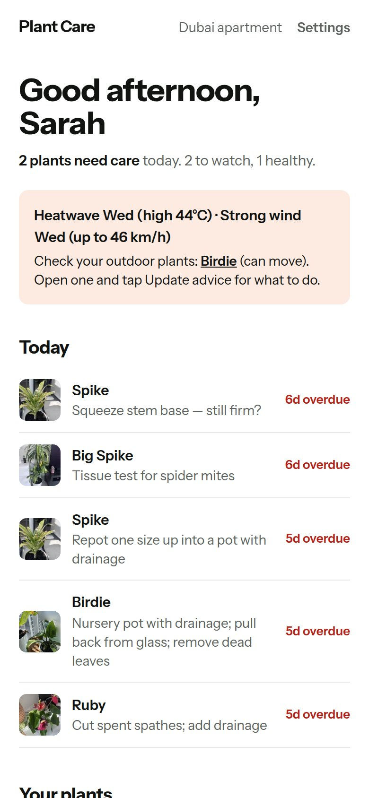
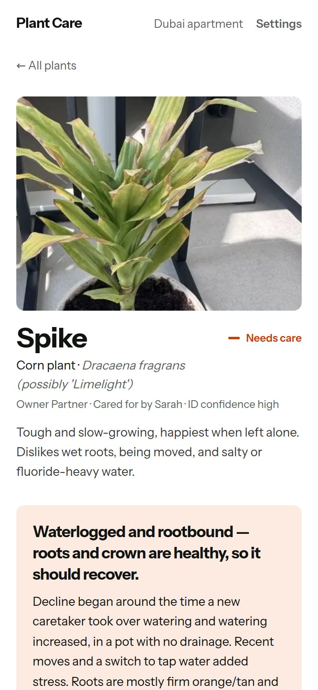
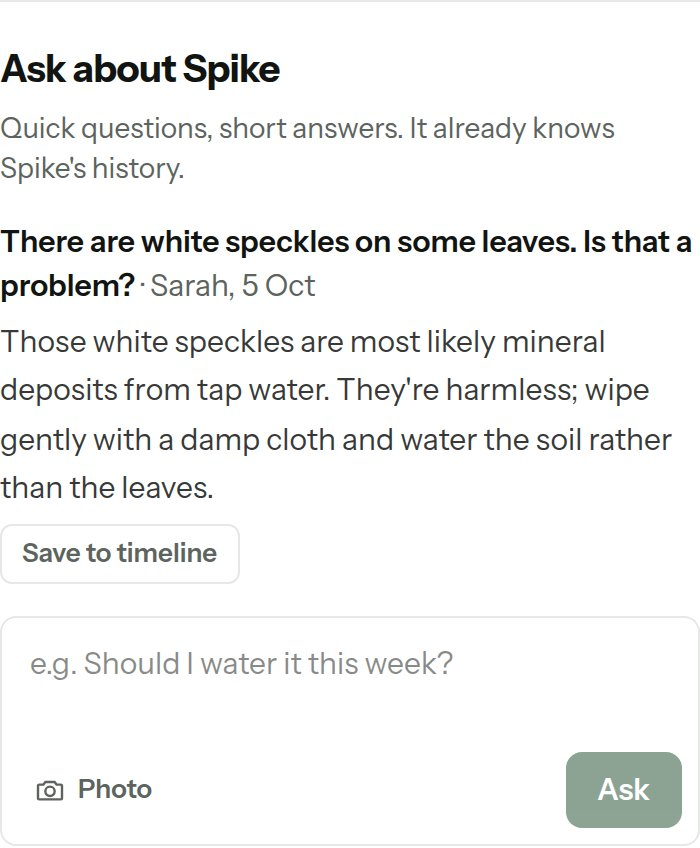
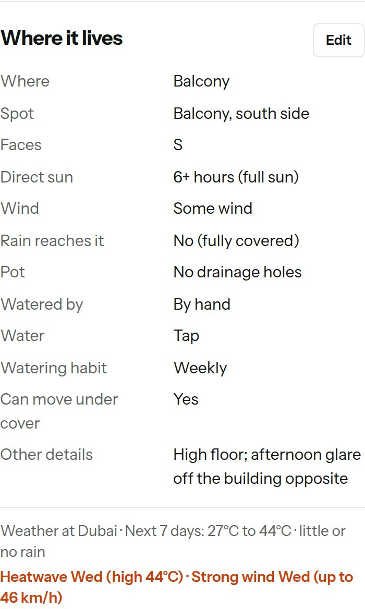
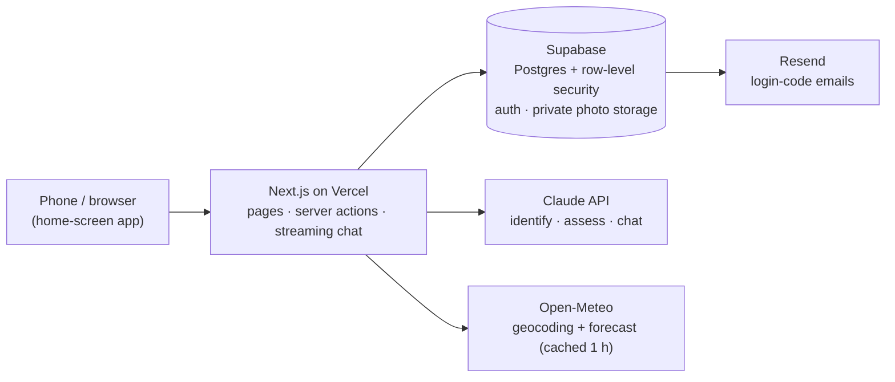

# Plant Care

**A plant-care app that remembers each plant's story and uses it to give advice that fits.**

Most plant apps give the same generic schedule to every plant of a species. In practice, plants decline because *something changed*: they were moved, someone else started watering them, or the water switched from bottled to tap. Plant Care keeps each plant's history and gives it to an AI coach, so the advice is about **this** plant, in **this** home.

Live at [plant-care.xyz](https://plant-care.xyz) (invite-only for now; screenshots below use the built-in sample plants).

<table>
  <tr>
    <td></td>
    <td></td>
    <td></td>
    <td></td>
  </tr>
  <tr>
    <td align="center"><sub>Today's checks and weather alerts</sub></td>
    <td align="center"><sub>Diagnosis grounded in history</sub></td>
    <td align="center"><sub>Quick questions, short answers</sub></td>
    <td align="center"><sub>Outdoor plants get local weather</sub></td>
  </tr>
</table>

---

## Why I built it

I started by assessing my own five plants by hand. Two things stood out:

- **All five had drainage problems**, and none of the generic care guides I'd read would have caught that.
- **Every decline lined up with a change**: one plant got worse after a new caretaker took over watering, two after moving home, and one after switching to tap water.

So the core idea is: **record what happens, and let the AI reason over the timeline**, not just a single photo.

**The loop:** Identify → Understand → Assess → Act → Record → Reassess

## What it does

| | |
|---|---|
| **Identify** | Up to 4 photos. Claude names the plant with an honest confidence level and, if unsure, asks for a closer photo of the part that would settle it (e.g. the stem). |
| **Understand** | The plant's ideal conditions, compared with where it actually lives: indoors (window, distance, AC) or outdoors (balcony, patio, garden: sun hours, wind, rain, can it be moved). |
| **Assess** | A diagnosis that cites the evidence ("decline began when the caretaker changed"), ranked likely causes, what to do now, what to watch, and dated next checks. |
| **Record** | A timeline of everything: watering, moves, repots, moisture-meter readings, photos, changes to conditions. Edits to "where it lives" are logged automatically. |
| **Ask** | A short chat on every plant page. It already knows the plant's history, answers in about 80 words, and lets you save a useful answer to the timeline with one tap. |
| **Weather** | Each home has a location. Outdoor plants get the past week's rain and the next week's forecast in every assessment, plus frost, heatwave, wind and heavy-rain alerts. |
| **Share** | One home can be shared by a household (a couple, family); each home's data is private to its members. |

## How the AI works

This was the most interesting part to get right.

**1. The briefing matters more than clever prompts.** Claude has no memory between calls, so every request includes a briefing written by [`context.ts`](src/lib/ai/context.ts): the plant, its ideal and current conditions, the home's location and season, equipment owned, the last 25 timeline entries ("today", "3 days ago"), the previous advice, open checks and, for outdoor plants, the weather. Most improvements came from changing this briefing, not the instructions.

> *Example:* early on, the coach kept asking "does the pot have drainage?" even though the user had said "plastic pot inside a decorative pot". The briefing was passing the internal code `cachepot`. Spelling it out ("nursery pot WITH holes inside an outer pot WITHOUT holes; water can collect unseen") fixed it.

**2. Structured outputs, defensively.** Identifications and assessments come back as JSON validated against a schema ([zod](src/lib/types.ts)). The helper checks *why* the model stopped, retries with more room if an answer was cut off, and logs token usage per call. That came straight from a real "unterminated JSON" bug.

**3. Choosing a model with an evaluation, not a guess.** [`compare-models.ts`](scripts/compare-models.ts) runs the same plants through two models and scores the answers.

| | Sonnet | Opus |
|---|---|---|
| Expected findings (11 checks) | 11/11 | 11/11 |
| Tone, timeline reasoning, caretaker cause | good | better |
| Time per assessment | ~34 s | ~21 s |
| Cost per assessment | ~$0.036 | ~$0.05 |

Both passed the keyword checks, which taught me keyword evals are too shallow on their own. I chose **Opus for full assessments** and **Sonnet for the quick chat**, where speed and cost matter more.

**4. Location changes the answer.** The home's city and country set the climate, the season and the hemisphere (October is spring in Cape Town, autumn in Washington; north-facing windows are the sunny ones in the south), plus °C or °F. Weather alerts use thresholds that are *relative* to the past week, so a normal Dubai summer doesn't trigger a heatwave alert every day.

**5. Voice rules.** I wrote house rules into the prompt myself: talk to "you", use natural time phrases, never quote internal field names, keep it short. See [`prompts.ts`](src/lib/ai/prompts.ts).

## Architecture



- **Data access goes through one interface** ([`store/index.ts`](src/lib/store/index.ts)) with two implementations: a local JSON file for development and Supabase for the live app.
- **Pages are server-rendered**, with loading skeletons for instant feedback. Login is checked once per request and cached.

## Security and cost controls

- **Row-level security** in the database: a plant, photo, question or reading is only visible to members of its home, even if the app had a bug. It's tested with simulated users (owner, partner, stranger) on a local Postgres. See [`supabase/`](supabase).
- **Invite-only:** login codes are only sent to approved or invited emails, and starting a new home requires approval.
- **Daily cap:** 30 AI actions per home per day, enforced *inside the database*, so it can't be bypassed from a browser. A monthly spend limit sits on top at the API account level.
- **No secrets in the repo:** API keys live in environment variables only.
- **Friendly failures:** a bad key, no credit or a busy API shows a plain sentence, and the weather simply drops out if the service is down.

## Built with

Next.js 16 (App Router, Server Actions, Route Handlers) · TypeScript · Tailwind CSS v4 · Claude API (vision, structured outputs, streaming) · Supabase (Postgres, Auth, Storage) · Vercel · Resend · Open-Meteo

## What I learned

- **Context beats prompting.** The quality of the briefing drove the quality of the advice.
- **Evaluate before choosing a model,** and make the evaluation measure what you care about.
- **Put guardrails where they can't be skipped:** access rules and spending limits in the database, not just the UI.
- **Ship to real users early.** Real use surfaced the issues no plan would have: the login-link loop, a misleading "Invite" button, a slow plant page and a certificate warning on a new domain.

## What's next

- Test advice quality with outdoor plants in three climates (Washington DC, Cape Town, Dubai balconies)
- Email alerts for frost and extreme heat
- Calibrating the moisture-meter thresholds against real readings

## Run it yourself

```bash
npm install
cp .env.example .env.local   # add your ANTHROPIC_API_KEY (or set PLANT_AI_MOCK=1 for canned answers)
npm run dev                  # http://localhost:3000, with five sample plants
```

Local mode stores data in `.data/` and needs no database. For the cloud version, create a Supabase project, run [`supabase/schema.sql`](supabase/schema.sql) and then the files in [`supabase/migrations/`](supabase/migrations) in order, and set the variables listed in `.env.example`. Useful scripts:

- `npm run briefing -- spike`: print exactly what Claude sees for a plant
- `npm run compare`: run the model comparison

The code is commented throughout (look for 📘 LEARN) as I built it to learn, not just to ship.

---

Built by Sarah, with Claude as a pair programmer: I made the product and design decisions, tested with real plants and users, and wrote parts of the prompts; Claude wrote most of the code with me and explained it as we went.

© 2026. All rights reserved.
